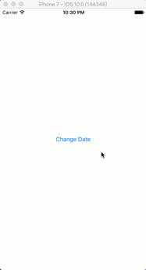

## Introduction



Simple customizable action sheet.

## Installation

### Requirement

iOS 8+

### [CocoaPods](http://cocoapods.org)

To install DTActionSheet add a dependency to your Podfile:

```
pod "DTActionSheet"
```

### [Carthage](https://github.com/Carthage/Carthage)

To install DTActionSheet add a dependency to your Cartfile:

```
github "danjiang/DTActionSheet"
```

```
carthage update --platform ios
```

## Usage

### Import

```swift
import DTActionSheet
```

### Inheritance

```swift
protocol DatePickerSheetDelegate {
  func datePickerSheet(_ sheet: DatePickerSheet, didSaveDate date: Date)
}

class DatePickerSheet: DTActionSheet {
  
  override var contentViewHeight: CGFloat {
    return 250
  }
  
  var delegate: DatePickerSheetDelegate?
  
  fileprivate let datePicker = UIDatePicker()
  
  required init?(coder aDecoder: NSCoder) {
    fatalError("init(coder:) has not been implemented")
  }
  
  init() {
    super.init(style: .darkBlur)
    
    contentView.backgroundColor = UIColor.red
    
    layoutDatePicker()
    layoutCancelButton()
    layoutSaveButton()
  }
  
  func save() {
    cancel()
    delegate?.datePickerSheet(self, didSaveDate: datePicker.date)
  }
  
  // MARK: - Private
  
  fileprivate func layoutDatePicker() {
    datePicker.datePickerMode = .date
    
    contentView.addSubview(datePicker)
    
    datePicker.translatesAutoresizingMaskIntoConstraints = false
    
    let bottom = NSLayoutConstraint(item: datePicker, attribute: .bottom, relatedBy: .equal, toItem: contentView, attribute: .bottom, multiplier: 1, constant: 0)
    let centerX = NSLayoutConstraint(item: datePicker, attribute: .centerX, relatedBy: .equal, toItem: contentView, attribute: .centerX, multiplier: 1, constant: 0)
    
    contentView.addConstraints([bottom, centerX])
  }
  
  fileprivate func layoutCancelButton() {
    let cancelButton = UIButton()
    cancelButton.setImage(#imageLiteral(resourceName: "cancel"), for: UIControlState())
    cancelButton.addTarget(self, action: #selector(dismiss), for: UIControlEvents.touchUpInside)
    
    contentView.addSubview(cancelButton)
    
    cancelButton.translatesAutoresizingMaskIntoConstraints = false
    
    let top = NSLayoutConstraint(item: cancelButton, attribute: .top, relatedBy: .equal, toItem: contentView, attribute: .top, multiplier: 1, constant: 15)
    let leading = NSLayoutConstraint(item: cancelButton, attribute: .leading, relatedBy: .equal, toItem: contentView, attribute: .leading, multiplier: 1, constant: 15)
    
    contentView.addConstraints([top, leading])
  }
  
  fileprivate func layoutSaveButton() {
    let saveButton = UIButton()
    saveButton.setImage(#imageLiteral(resourceName: "save"), for: UIControlState())
    saveButton.addTarget(self, action: #selector(save), for: UIControlEvents.touchUpInside)
    
    contentView.addSubview(saveButton)
    
    saveButton.translatesAutoresizingMaskIntoConstraints = false
    
    let top = NSLayoutConstraint(item: saveButton, attribute: .top, relatedBy: .equal, toItem: contentView, attribute: .top, multiplier: 1, constant: 15)
    let trailing = NSLayoutConstraint(item: saveButton, attribute: .trailing, relatedBy: .equal, toItem: contentView, attribute: .trailing, multiplier: 1, constant: -15)
    
    contentView.addConstraints([top, trailing])
  }
  
}
```

### Use

```
class ViewController: UIViewController {
  
  @IBOutlet weak var button: UIButton!

  override func viewDidLoad() {
    super.viewDidLoad()
  }

  @IBAction func changeDate(_ sender: AnyObject) {
    let sheet = DatePickerSheet()
    sheet.delegate = self
    sheet.show()
  }
  
}

// MARK: -

extension ViewController: DatePickerSheetDelegate {
  
  func datePickerSheet(_ sheet: DatePickerSheet, didSaveDate date: Date) {
    button.setTitle(date.description, for: .normal)
  }

}
```
